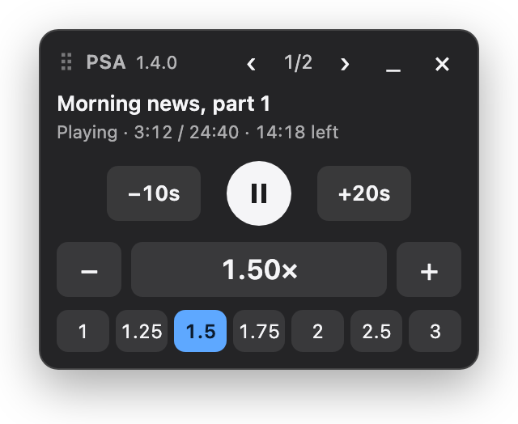

# Playing Speed Adjuster (PSA)

PSA is a bookmarklet that opens a small floating panel for the HTML5 `<audio>` and `<video>` on the current page. It works on any site; nothing in it is specific to one site.



- Speed from 0.25× to 4×: −/+ in 0.05 steps, presets (1, 1.25, 1.5, 1.75, 2, 2.5, 3), click the readout and type a value (`1.6`, `1.6x`, `160%`), or use the [keyboard shortcuts](#keyboard-shortcuts).
- Applies the speed to **every** audio and video element on the page, including ones added later, ones inside open shadow roots and same-origin iframes, and off-page `new Audio()` players.
- Remembers the speed (and panel position) per site in `localStorage`, and where you left off in long recordings: play one again from the start and the panel offers **Resume at 12:34**.
- Keeps re-applying the speed so sites that reset `playbackRate` don't win.
- Play/Pause, −10 s / +20 s skips, a best-effort title and the real time left at your speed for the active item (the one that most recently started playing), plus a picture-in-picture button for videos. Use ‹ › to pick another item; the one you pick is outlined on the page, and scrolled into view if needed.
- Live streams (live radio, anything without an end) stay at normal speed, since speeding them up only causes buffering.
- Drag the panel by its top bar, or minimize it to a small pill that shows the speed (remembered per site). It stays open until you click × or run the bookmarklet again, and stays on top of fullscreen video and the page's own dialogs and popovers.

## Install

**[Open the install page](https://codexjdub.github.io/Playing-Speed-Adjuster/)** and drag the **PSA** button onto your bookmarks bar. The page also has demo tracks to try it on.

Or copy and paste: open [`dist/bookmarklet.txt`](dist/bookmarklet.txt) on GitHub and click **Copy raw file**. Create a bookmark named `PSA` and paste the copied line as its URL. In Safari, bookmark any page, then use **Edit Address…** on it.

The [test page](https://codexjdub.github.io/Playing-Speed-Adjuster/test/test-page.html) has many kinds of players and a button that runs automated checks.

Click the bookmark on a page with audio or video to open the panel. Click it again, or click ×, to close it.

## Keyboard shortcuts

While the panel is open, including minimized:

| Key | Action |
| --- | --- |
| `[` | Slow down by 0.1 |
| `]` | Speed up by 0.1 |
| `\` | Set 1.5× |

They're ignored while you type in a text field, and ⌘ or Ctrl combinations are left to the browser (⌘[ is still Back). When PSA handles a key, the page doesn't also receive it.

## Updating

Bookmarklets don't update themselves. The panel shows its version next to "PSA", and the install page shows the latest one. If yours is older, drag the button from the install page to your bookmarks bar again and delete the old bookmark. See [Releases](https://github.com/codexjdub/Playing-Speed-Adjuster/releases) for what changed.

## How it works

`src/psa.js` is the readable source and `src/install.html` is the install page template; `npm run build` rebuilds `dist/` and the site's `index.html`. The build minifies the code with [terser](https://terser.org/), checks the result parses, and percent-encodes only the characters a `javascript:` URL can't carry, which keeps the bookmarklet around 26 KB.

- **Finding media.** Every 500 ms the panel queries each known document and shadow root for `audio, video`; every 2 s it re-walks the page to find new open shadow roots and same-origin iframes. While the panel is open, `HTMLMediaElement.prototype.play` is wrapped so players that are never inserted into the page are found too; closing the panel restores it.
- **Holding the speed.** Live streams are left alone: a MediaStream source, an `Infinity` duration, or a duration that keeps growing (chunked live players such as RTHK live radio). One that was sped up before it was known to be live is put back to 1×. For everything else it sets both `playbackRate` and `defaultPlaybackRate`, the latter because `load()` resets to it. It re-applies whenever the page changes a player's speed or source, when a player starts, and on every tick. If a site resets an element more than 8 times in 2 s, the panel replaces that element's `playbackRate` setter so the page's writes are ignored ("speed locked" in the panel). Closing the panel removes the lock.
- **Resume positions.** While the panel is open, it saves how far each recording longer than 3 minutes has got: every 5 s while playing, and at once on pause or when you leave the page. Recordings are told apart by page address and length, because many sites play through a temporary `blob:` address that changes on every visit. Positions in the first 30 s aren't saved, so starting over doesn't lose the old one, and a recording played to within 30 s of its end is forgotten. They live in the site's `localStorage` under their own key, up to 100 per site.
- **Picture-in-picture.** For a video with a picture, the panel calls `requestPictureInPicture()`, first clearing `disablePictureInPicture` if the site set it. Firefox has no such API (it has its own picture-in-picture button), so the button isn't shown there.
- **Titles**, first match wins:
  1. The element's own `aria-label`, `aria-labelledby` or `title`.
  2. Text next to the player: walk outwards one container at a time and take the first visible heading, else visible text. Skip player controls, timecodes, text drawn over the video, and screen-reader-only text. Stop before a container that holds another player, because shared text can't tell them apart.
  3. Media Session metadata (`title — artist`), only when that item is the one playing.
  4. The media file name.
  5. The page title.

  With a single player on the page, Media Session is tried before nearby text.
- **Isolation.** The panel lives in a shadow root on a `popover="manual"` host, so it sits in the top layer above page content. It is re-shown on top when fullscreen starts or the page opens its own dialog or popover, and while a modal dialog is open it moves inside it, since a modal dialog makes everything outside it unclickable. The UI is built with DOM calls only (no `innerHTML`), so Trusted Types pages like YouTube don't block it. Styles use a constructed stylesheet, which a `style-src` CSP doesn't block. Keystrokes and clicks inside the panel don't reach the page, so typing a speed doesn't trigger site shortcuts. Clicking panel buttons doesn't take keyboard focus from the page.

## Limits

- Media inside **cross-site iframes** (e.g. a YouTube embed on a blog) can't be reached. Open the embed's own page and run the bookmarklet there.
- Closed shadow roots and players that use only the Web Audio API have no reachable media element.
- In browsers without the Popover API, the panel can't show over a bare fullscreen `<video>` or the page's own dialogs.

## Development

Bump `VERSION` at the top of `src/psa.js` for each release; the build copies it to the install page.

```
npm ci
npm run build
npm test
```

`npm ci` installs the development tools (Node 20+): terser for the build and Playwright for the tests. Neither goes into the bookmarklet.

`npm test` opens the test page in headless Chrome, using your installed copy so nothing extra is downloaded. It runs the page's checks and clicks the real bookmarklet link on the install page. The test page covers labelled and unlabelled players, a shared heading with per-player labels, a stubborn page that keeps resetting the speed, a late-inserted player, shadow DOM, a same-origin iframe, off-page audio with Media Session, a playlist that calls `load()`, screen-reader-only text, a fullscreen container, live streams, a text field inside a closed shadow root, a modal dialog, a popover over the whole page and a long recording; it also checks the skip buttons, the time left, picture-in-picture, resuming, the speed box, minimizing, the outline and the keyboard shortcuts. The runner also checks that the test server serves only the site's files.

To try things by hand, run `npm run serve`, open http://127.0.0.1:8765/test/test-page.html, click **Load PSA**, pick a speed other than 1×, and click **Run checks**.

On every push, two GitHub Actions run:

- **Build check:** rebuilds and fails if the committed `dist/` or `index.html` doesn't match `src/`.
- **Tests:** runs the same checks in Chromium, Firefox and WebKit (Safari's engine).

## License

[MIT](LICENSE)
